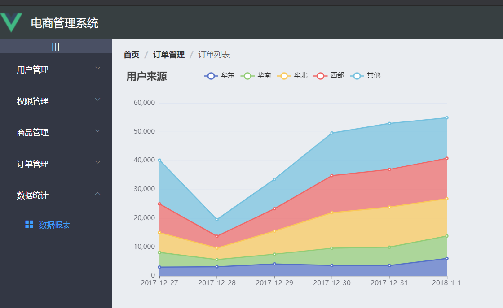
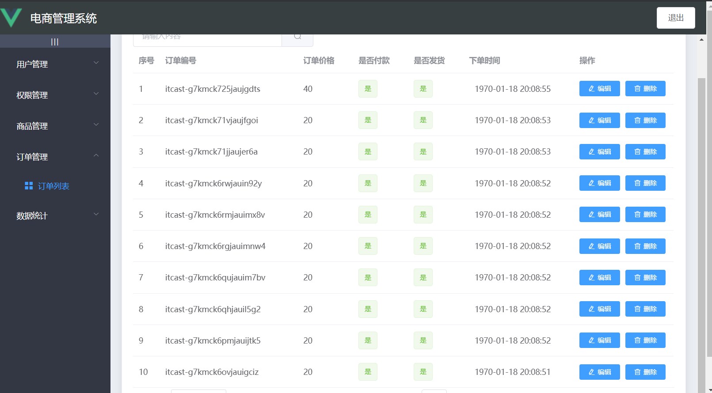
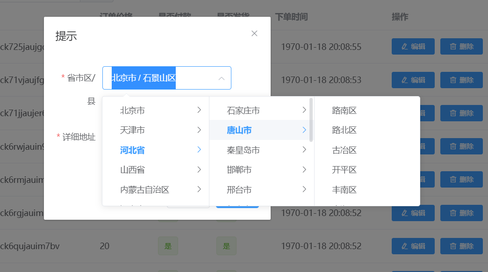
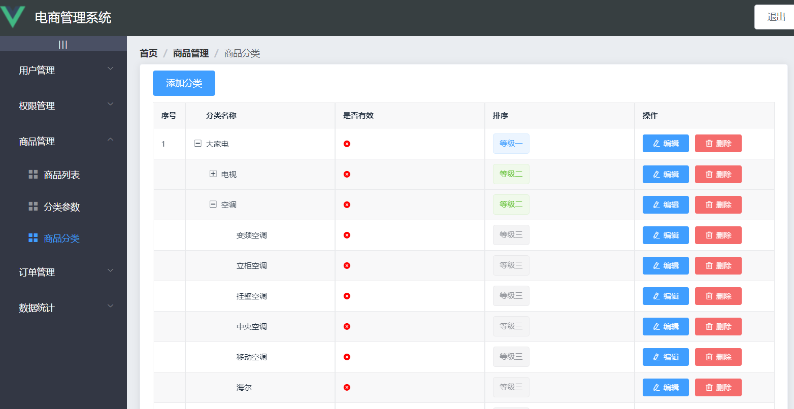
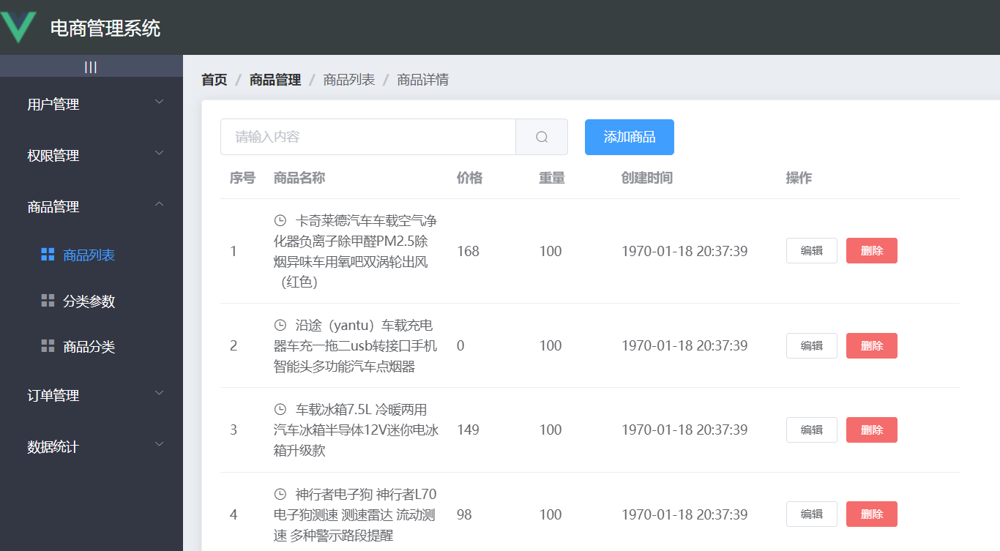
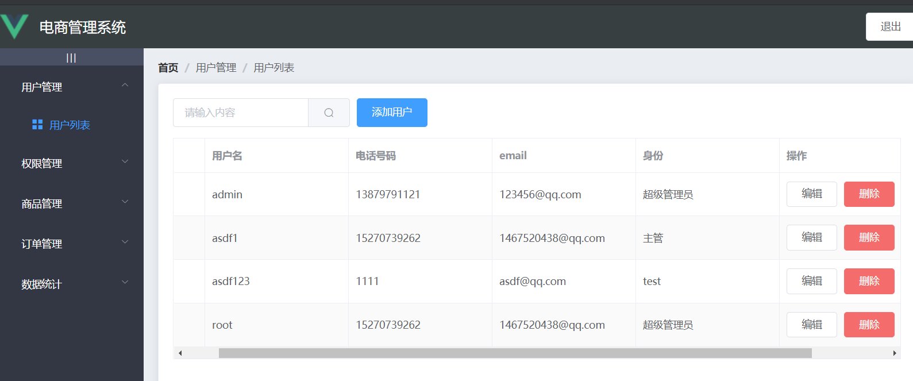
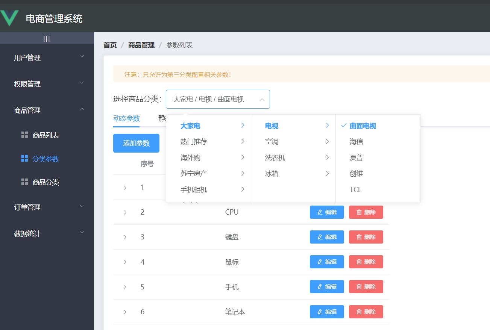
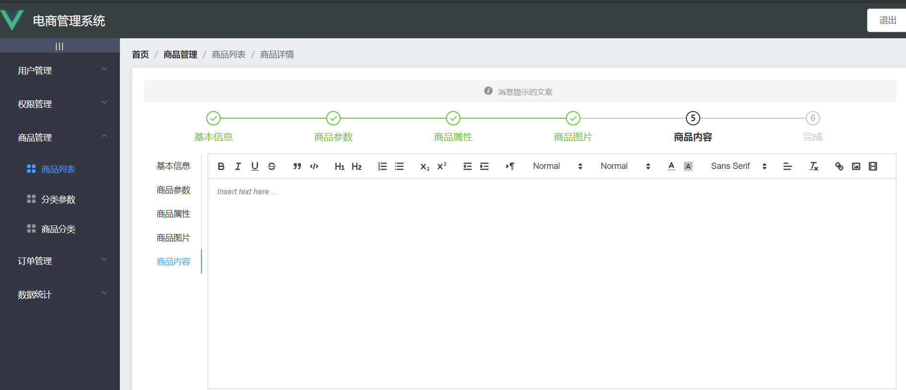

# SHOW

</img>


</img>


</img>


</img>


</img>


</img>


</img>


</img>


## Project setup

```
npm install
```

### Compiles and hot-reloads for development
```
npm run serve
```

### Compiles and minifies for production
```
npm run build
```

### Lints and fixes files
```
npm run lint
```

### Customize configuration
See [Configuration Reference](https://cli.vuejs.org/config/).


鸣谢：后端 @wBekvam

获取地址：gitee：https://gitee.com/wBekvam

​	github：https://github.com/github-HDC/vue-Manage-System/tree/userCompletedev/backend
